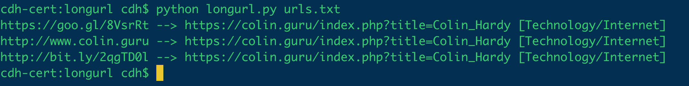

# long_url

## Overview
This code is designed to unshorten short URLs, follow recursive redirects and output the end destination to the console coupled with the Bluecoat Site Review categorisation of the final URL in the chain. This can be useful if you have several short URLs to examine and need to quickly determine the destination and whether it's perceived by Bluecoat to be malicious.

## Install
There are a couple of requirements for the script to run correctly, as detailed in requirements.txt. Installation can be carried out via executing the following:

    $ pip install -r requirements.txt

## Run
After installing the requirements, simply invoke via the command line, passing in a file containing your short urls as an argument, e.g.

    $ python longurl.py -i urls.txt [-b]
        options:
        -i / --infile : specifies the input file containing the urls to examine.
        -b / --bluecoat : specified whether you wish to perform a bluecoat site review on the destination url.
    
## Example
Some sample URLs are provided in the urls.txt all leading (shamelessly) to my website. They also follow recursive redirects, for example the bit.ly link redirects to goo.gl which redirects to colin.guru. 

## Licence
Released under MIT Licence. Enjoy.

## Feedback
I welcome feedback of any kind cdh.cert@gmail.com
